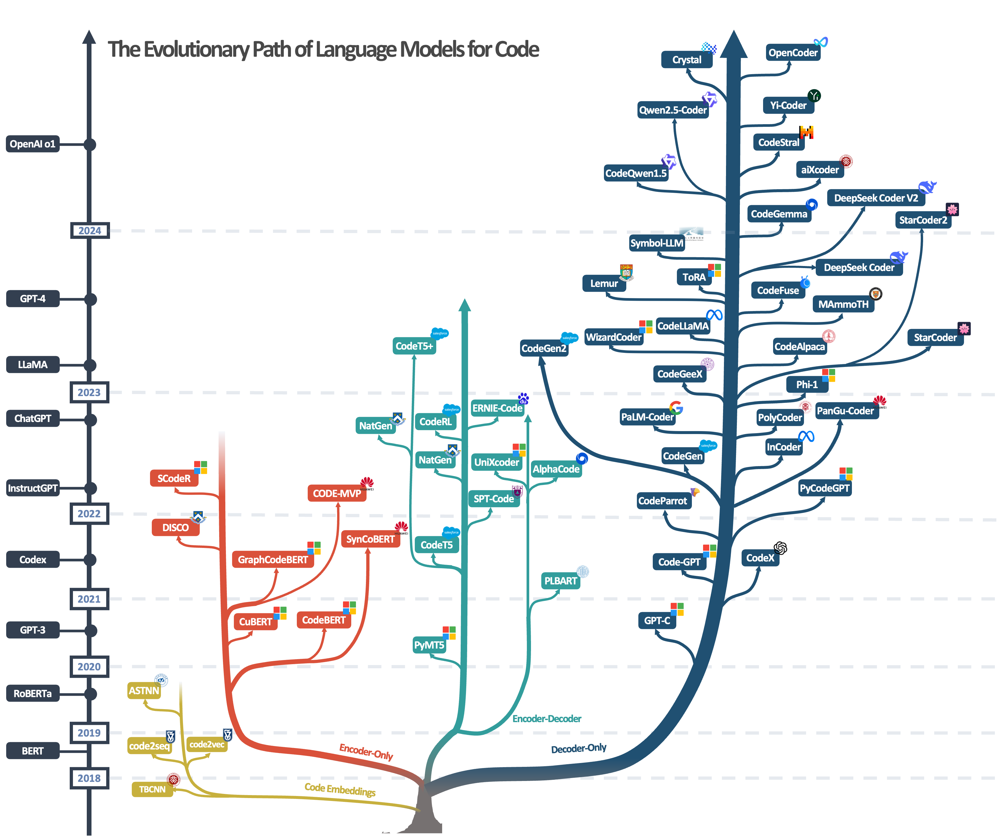

<!-- ## A Survey of Neural Code Intelligence: Paradigms, Advances and Beyond -->

## Neural Code Intelligence Survey
This is the repository of our paper: **A Survey of Neural Code Intelligence: Paradigms, Advances and Beyond**.

 <!-- [[Paper](https://qiushisun.github.io/)] -->

[](https://arxiv.org/abs/2403.14734) 
[](https://GitHub.com/Naereen/StrapDown.js/graphs/commit-activity) 
[](http://makeapullrequest.com)
[](https://awesome.re)

[](https://huggingface.co/papers/2403.14734)
[](https://twitter.com/qiushi_sun)
<!-- [🤗](https://huggingface.co/papers/2403.14734) -->

*Please do not hesitate to contact us or launch pull requests if you find any related papers that are missing in our paper.*

## News 📰
- Update on 2025/01/26: Version 1.6 released with additional topics on code preference learning 📖
- Update on 2024/11/01: Version 1.4 released with extra paper collections 📖
- Update on 2024/06/23: Version 1.2 released 🚀
- Update on 2024/03/19: Version 1.0 released 🚀
- Update on 2024/01/19: Add multiple reading lists 📖
- Update on 2023/12/29: Add Development Timelines 📅
- Update on 2023/12/25: Add Reading Lists, Merry Christmas 🍎🎄

## Introduction 📜

📃 [**A Survey of Neural Code Intelligence: Paradigms, Advances and Beyond**](https://arxiv.org/abs/2403.14734) 
>
> [Qiushi Sun](https://qiushisun.github.io/),
[Zhirui Chen](https://github.com/jet1004),
[Fangzhi Xu](https://xufangzhi.github.io/),
[Kanzhi Cheng](https://scholar.google.com/citations?user=S2IPVnwAAAAJ&hl=zh-CN),
[Chang Ma](https://chang-github-00.github.io/-changma/),
[Zhangyue Yin](https://scholar.google.com/citations?user=9gRQqSkAAAAJ&hl=en),
[Jianing Wang](https://wjn1996.github.io/),
[Chengcheng Han](https://hccngu.github.io/),
[Renyu Zhu](https://scholar.google.com/citations?user=tSWULnAAAAAJ&hl=en), 
[Shuai Yuan](https://github.com/Luciferder),
[Qipeng Guo](https://scholar.google.com/citations?user=k3mPGKgAAAAJ&hl=en),
[Xipeng Qiu](https://xpqiu.github.io/),
[Pengcheng Yin](https://pengcheng.in/),
[Xiaoli Li](https://www.a-star.edu.sg/i2r/about-i2r/i2r-management/li-xiaoli), 
[Fei Yuan](https://github.com/CONE-MT), 
[Lingpeng Kong](https://ikekonglp.github.io/), 
[Xiang Li](https://lixiang3776.github.io/), 
[Zhiyong Wu](https://lividwo.github.io/zywu.github.io/)

Introducing the resources provided by our survey paper, slides is also available at [here](assets/NCI_Survey_Slides_V1.pdf).

## Timeline

<details open>
<summary>The Development of Code Intelligence</summary>



</details>


## Recent Work on Code Intelligence (Welcome PR) 📗


- [CodeI/O: Condensing Reasoning Patterns via Code Input-Output Prediction](https://arxiv.org/abs/2502.07316) 2025.2
- [Competitive Programming with Large Reasoning Models](https://arxiv.org/abs/2502.06807) 2025.2
- [EpiCoder: Encompassing Diversity and Complexity in Code Generation](https://arxiv.org/abs/2501.04694v1) 2025.1
- [WarriorCoder: Learning from Expert Battles to Augment Code Large Language Models](https://arxiv.org/abs/2412.17395) 2024.12
- [FullStack Bench: Evaluating LLMs as Full Stack Coders](https://arxiv.org/abs/2412.00535) 2024.12
- [CodeDPO: Aligning Code Models with Self Generated and Verified Source Code](https://arxiv.org/abs/2410.05605) 2024.11
- [OpenCoder: The Open Cookbook for Top-Tier Code Large Language Models](https://opencoder-llm.github.io/) 2024.11
- [Qwen2.5-Coder Series: Powerful, Diverse, Practical.](https://github.com/QwenLM/Qwen2.5-Coder) 2024.11
<!-- - [RLEF: Grounding Code LLMs in Execution Feedback with Reinforcement Learning](https://huggingface.co/papers/2410.02089) 2024.10 -->
<!-- - [To Code, or Not To Code? Exploring Impact of Code in Pre-training](https://arxiv.org/abs/2408.10914) 2024.08 -->
  

<!-- - [Interactive Evolution: A Neural-Symbolic Self-Training Framework For Large Language Models](https://arxiv.org/abs/2406.11736) 2024.06
- [Symbolic Learning Enables Self-Evolving Agents](https://arxiv.org/pdf/2406.18532v1) 2024.06
- [aiXcoder](https://huggingface.co/aiXcoder/aixcoder-7b-base) 2024.04
- [Making Language Models Better Tool Learners with Execution Feedback](https://arxiv.org/abs/2305.13068) 2024.03 -->


## Paper Collections / Tutorials 📚

- [Language Models for Code](https://github.com/QiushiSun/NCISurvey/blob/main/paper-reading/CodeLMs.md) 🤖
- [Evaluations and Benchmarks](https://github.com/QiushiSun/NCISurvey/blob/main/paper-reading/Benchmarks.md) 📊 
- [Preference Optimization](https://github.com/QiushiSun/NCISurvey/blob/main/paper-reading/Preference-Optimization.md) 🍎
- [Code Repair](https://github.com/QiushiSun/NCISurvey/blob/main/paper-reading/Repair.md) 🔧
- [Reasoning with Code Synthesis](https://github.com/QiushiSun/NCISurvey/blob/main/paper-reading/Reasoning.md) 🧠
- [Data Science](https://github.com/QiushiSun/NCISurvey/blob/main/paper-reading/DS.md) 🔢
- [Corpus containing Code Data](https://github.com/QiushiSun/NCISurvey/blob/main/paper-reading/Code-corpus.md) 📚
- [Code-Based Solutions for NLP Tasks](https://github.com/QiushiSun/NCISurvey/blob/main/paper-reading/NLPTasks-through-code.md) 📝
- [Code Empowered Agents](https://github.com/QiushiSun/NCISurvey/blob/main/paper-reading/CodeLM-empowered-agents.md) 🤖
- [Reinforcement Learning with CodeLMs](https://github.com/QiushiSun/NCISurvey/blob/main/paper-reading/RL-with-CodeLMs.md) 🎮
- [Code Intelligence assists AI4Science](https://github.com/QiushiSun/NCISurvey/blob/main/paper-reading/AI4Science.md) 🧪
- [Software Development](https://github.com/QiushiSun/NCISurvey/blob/main/paper-reading/Software-Development.md) 🛠️
- [Multilingual](https://github.com/QiushiSun/NCISurvey/blob/main/paper-reading/multilingual.md) 🌍
- [Multimodal Code Generation](https://github.com/QiushiSun/NCISurvey/blob/main/paper-reading/Multimodal.md) 🎨
- [Awesome Slides, Talks and Blogs](https://github.com/QiushiSun/NCISurvey/blob/main/paper-reading/tutorials.md) 🧑‍🏫

## Citation 📖

🫶 If you are interested in our work or find this repository helpful, please consider using the following citation format when referencing our paper:

```bibtex
@article{sun2024survey,
  title={A survey of neural code intelligence: Paradigms, advances and beyond},
  author={Sun, Qiushi and Chen, Zhirui and Xu, Fangzhi and Cheng, Kanzhi and Ma, Chang and Yin, Zhangyue and Wang, Jianing and Han, Chengcheng and Zhu, Renyu and Yuan, Shuai and others},
  journal={arXiv preprint arXiv:2403.14734},
  year={2024}
}
```
## Table of Contents

1. [Language Models for Code](#CodeLMs)
   - [CodeLLMs / Decoder-Only](#CodeLLMs)
   - [Encoder-Decoder](#enc-dec)
   - [Encoder-Only](#enc)
   - [Others](#others)
2. [Evaluations and Benchmarks](#Benchmarks)

## Language Models for Code <a id="CodeLMs"></a>

### CodeLLMs / Decoder-Only <a id="CodeLLMs"></a>

1. [Preprint] **Qwen2.5-Coder Series: Powerful, Diverse, Practical.** [[Website]](https://github.com/QwenLM/Qwen2.5-Coder), 2024.11
2. [Preprint] **OpenCoder: The Open Cookbook for Top-Tier Code Large Language Models** [[Website]](https://opencoder-llm.github.io/) [](https://arxiv.org/abs/2411.04905), 2024.11

3. [[COLM2024]](https://openreview.net/forum?id=kWnlCVcp6o#discussion) **Crystal: Illuminating LLM Abilities on Language and Code** [](https://arxiv.org/abs/2411.04156), 2024.10
4. [Preprint]  [[Website]](https://github.com/aixcoder-plugin/aiXcoder-7B)
5. [Preprint] **CodeGeeX4: Open Multilingual Code Generation Model.** [[Repo]](https://github.com/THUDM/CodeGeeX4), 2024.07
6. [Preprint] **CodeGemma: Open Code Models Based on Gemmaa.** [](https://arxiv.org/abs/2406.11409), 2024.06
7. [Preprint] **Codestral** [[Website]](https://mistral.ai/news/codestral/), 2024.05
8. [Preprint] **Code with CodeQwen1.5** [[Blog Post]](https://qwenlm.github.io/blog/codeqwen1.5/), 2024.04
9. [Preprint] **StarCoder 2 and The Stack v2: The Next Generation.** [](https://arxiv.org/abs/2402.19173), 2024.02
10. [Preprint] **DeepSeek-Coder: When the Large Language Model Meets Programming -- The Rise of Code Intelligence.** [](https://arxiv.org/abs/2401.14196), 2024.01
11. [Preprint]  [](https://arxiv.org/abs/2311.09278), 2023.11 [](https://zhuanlan.zhihu.com/p/690058207)
12.  **Llemma: An Open Language Model For Mathematics.** [](https://arxiv.org/abs/2310.10631), 2023.10
13.  **Lemur: Harmonizing Natural Language and Code for Language Agents.** [](https://arxiv.org/abs/2310.06830), 2023.10
14. [Preprint] **ToRA: A Tool-Integrated Reasoning Agent for Mathematical Problem Solving.** [](https://arxiv.org/abs/2309.17452), 2023.09
15. [Preprint] **MAmmoTH: Building Math Generalist Models through Hybrid Instruction Tuning.** [](https://arxiv.org/abs/2309.05653), 2023.09
16. [Preprint] `phi-1.5` **Textbooks Are All You Need II: phi-1.5 technical report.** [](https://arxiv.org/abs/2309.05463), 2023.09
17. [Preprint] **Code Llama: Open Foundation Models for Code.** [](https://arxiv.org/abs/2308.12950), 2023.08
18. [Preprint] `OctoCoder` **OctoPack: Instruction Tuning Code Large Language Models.** [](https://arxiv.org/abs/2308.07124), 2023.08
19. [Preprint] **PanGu-Coder2: Boosting Large Language Models for Code with Ranking Feedback.** [](https://arxiv.org/abs/2307.14936), 2023.07
20. [Preprint] `phi-1` **Textbooks Are All You Need.** [](https://arxiv.org/abs/2306.11644), 2023.06
21. [Preprint] **WizardCoder: Empowering Code Large Language Models with Evol-Instruct.** [](https://arxiv.org/abs/2306.08568), 2023.06
22.  **StarCoder: may the source be with you!** [](https://arxiv.org/abs/2305.06161), 2023.05
23.  **CodeGeeX: A Pre-Trained Model for Code Generation with Multilingual Evaluations on HumanEval-X.** [](https://arxiv.org/abs/2303.17568), 2023.03
24. [Preprint] **SantaCoder: don't reach for the stars!** [](https://arxiv.org/abs/2301.03988), 2023.01
25. [Preprint] `FIM` **Efficient Training of Language Models to Fill in the Middle.** [](https://arxiv.org/abs/2207.14255), 2022.07
26. [Preprint] **PanGu-Coder: Program Synthesis with Function-Level Language Modeling.** [](https://arxiv.org/abs/2207.11280), 2022.07
27.  `PyCodeGPT` **CERT: Continual Pre-Training on Sketches for Library-Oriented Code Generation** [](https://arxiv.org/abs/2206.06888), 2022.06
28.  **InCoder: A Generative Model for Code Infilling and Synthesis.** [](https://arxiv.org/abs/2204.05999), 2022.04
29.  `PaLM-Coder` **PaLM: Scaling Language Modeling with Pathways.** [](https://arxiv.org/abs/2204.02311), 2022.04
30.  **CodeGen: An Open Large Language Model for Code with Multi-Turn Program Synthesis.** [](https://arxiv.org/abs/2203.13474), 2022.03
31.  `PolyCoder` **A Systematic Evaluation of Large Language Models of Code.** [](https://arxiv.org/abs/2202.13169), 2022.02
32. [Preprint] `Code-davinci-002` **Evaluating Large Language Models Trained on Code.** [](https://arxiv.org/abs/2107.03374), 2021.7
33. [[ESEC/FSE2020]](https://2020.esec-fse.org/details/esecfse-2020-industry-papers/13/IntelliCode-Compose-Code-Generation-using-Transformer) `GPT-C` **IntelliCode Compose: Code Generation using Transformer.** [](https://arxiv.org/abs/2005.08025), 2020.05

### Encoder-Decoder <a id="enc-dec"></a>

1. [[EMNLP2023]](https://aclanthology.org/2023.emnlp-main.68/) **CodeT5+: Open Code Large Language Models for Code Understanding and Generation.** [](https://arxiv.org/abs/2305.07922), 2023.05

2. [[ACL2023]](https://aclanthology.org/2023.findings-acl.676/) **ERNIE-Code: Beyond English-Centric Cross-lingual Pretraining for Programming Languages.** [](https://arxiv.org/abs/2212.06742), 2022.12

3. [[NeurIPS2022]](https://openreview.net/forum?id=WaGvb7OzySA) **CodeRL: Mastering Code Generation through Pretrained Models and Deep Reinforcement Learning.** [](https://arxiv.org/abs/2207.01780), 2022.07

4. [[ESEC/FSE]](https://dl.acm.org/doi/abs/10.1145/3540250.3549162) **NatGen: Generative pre-training by "Naturalizing" source code.** [](https://arxiv.org/abs/2206.07585), 2022.06

5. [[ACL2022]](https://aclanthology.org/2022.acl-long.499/) **UniXcoder: Unified Cross-Modal Pre-training for Code Representation.** [](https://arxiv.org/abs/2203.03850), 2022.03

6. [[Science]](https://www.science.org/doi/full/10.1126/science.abq1158) **Competition-Level Code Generation with AlphaCode.** [](https://arxiv.org/abs/2203.07814), 2022.02

7. [[ICSE2022]](https://dl.acm.org/doi/abs/10.1145/3510003.3510096) **SPT-Code: Sequence-to-Sequence Pre-Training for Learning Source Code Representations.** [](https://arxiv.org/abs/2201.01549), 2021.01

8. [[EMNLP2021]](https://aclanthology.org/2021.emnlp-main.685/) **CodeT5: Identifier-aware Unified Pre-trained Encoder-Decoder Models for Code Understanding and Generation.** [](https://arxiv.org/abs/2109.00859), 2021.09

9. [[NAACL2021]](https://aclanthology.org/2021.naacl-main.211/) **Unified Pre-training for Program Understanding and Generation.** [](https://arxiv.org/abs/2103.06333), 2021.03

### Encoder-Only <a id="enc"></a>

1. [Preprint] **SynCoBERT: Syntax-Guided Multi-Modal Contrastive Pre-Training for Code Representation.** [](https://arxiv.org/abs/2108.04556), 2021.08

2. [[EMNLP2022]](https://aclanthology.org/2022.findings-emnlp.9/) `SCodeR` **Soft-Labeled Contrastive Pre-training for Function-level Code Representation.** [](https://arxiv.org/abs/2210.09597), 2020.10

3. [[ICLR2021]](https://openreview.net/forum?id=jLoC4ez43PZ) **GraphCodeBERT: Pre-training Code Representations with Data Flow.** [](https://arxiv.org/abs/2009.08366), 2020.09

4. [[NAACL2022]](https://aclanthology.org/2022.findings-naacl.80/) **CODE-MVP: Learning to Represent Source Code from Multiple Views with Contrastive Pre-Training.** [](https://arxiv.org/abs/2205.02029), 2020.05

5. [[EMNLP2020]](https://aclanthology.org/2020.findings-emnlp.139/) **CodeBERT: A Pre-Trained Model for Programming and Natural Languages.** [](https://arxiv.org/abs/2002.08155), 2020.02

6. [[ICML2020]](https://proceedings.mlr.press/v119/kanade20a.html)**Learning and Evaluating Contextual Embedding of Source Code.** [](https://arxiv.org/abs/2001.00059), 2019.12


## Others <a id="others"></a>

1. [[EMNLP2023]](https://aclanthology.org/2023.emnlp-main.716/) **CodeFusion: A Pre-trained Diffusion Model for Code Generation.** [](https://arxiv.org/abs/2310.17680), 2023.10

## Code-related Evaluation and Benchmarks <a id="Benchmarks"></a>

1. [Preprint] **Commit0: Library Generation from Scratch.** [](https://arxiv.org/abs/2412.01769), 2024.12

2. [Preprint] **FullStack Bench: Evaluating LLMs as Full Stack Coders.** [](https://arxiv.org/abs/2412.00535), 2024.12

3. [Preprint] **Spider 2.0: Evaluating Language Models on Real-World Enterprise Text-to-SQL Workflows.** [](https://arxiv.org/abs/2411.07763), 2024.11

4. [Preprint] **MdEval: Massively Multilingual Code Debugging.** [](https://arxiv.org/abs/2411.02310), 2024.11

5. [Preprint] **BigCodeBench: Benchmarking Code Generation with Diverse Function Calls and Complex Instructions.** [](https://arxiv.org/abs/2406.15877), 2024.10

6. [Preprint] **M2rc-Eval: Massively Multilingual Repository-level Code Completion Evaluation.** [](https://arxiv.org/abs/2410.21157), 2024.10

7. [Preprint] **HumanEval-V: Evaluating Visual Understanding and Reasoning Abilities of Large Multimodal Models Through Coding Tasks.** [](https://arxiv.org/abs/2410.12381), 2024.10

8. [Preprint] **FuzzCoder: Byte-level Fuzzing Test via Large Language Model.** [](https://arxiv.org/abs/2409.01944), 2024.09

9. [Preprint] **CodeRAG-Bench: Can Retrieval Augment Code Generation?** [](https://arxiv.org/abs/2406.14497), 2024.05

10. [Preprint] **McEval: Massively Multilingual Code Evaluation.** [](https://arxiv.org/abs/2406.07436), 2024.06

11. [Preprint] **MHPP: Exploring the Capabilities and Limitations of Language Models Beyond Basic Code Generation.** [](https://arxiv.org/abs/2405.11430), 2024.05

12. [Preprint] **NaturalCodeBench: Examining Coding Performance Mismatch on HumanEval and Natural User Prompts.** [](https://arxiv.org/abs/2405.04520), 2024.05

13. [Preprint] **CodeEditorBench: Evaluating Code Editing Capability of Large Language Models.** [](https://arxiv.org/abs/2404.03543), 2024.04

14. [Preprint] **LiveCodeBench: Holistic and Contamination Free Evaluation of Large Language Models for Code.** [](https://arxiv.org/abs/2403.07974), 2024.03

15. [Preprint] **DebugBench: Evaluating Debugging Capability of Large Language Models.** [](https://arxiv.org/abs/2401.04621), 2024.01

16. [[ICML2024]](https://openreview.net/forum?id=Ffpg52swvg) **CRUXEval: A Benchmark for Code Reasoning, Understanding and Execution.** [](https://arxiv.org/abs/2401.03065), 2024.01

17. [Preprint] `VulBench` **How Far Have We Gone in Vulnerability Detection Using Large Language Models.** [](https://arxiv.org/abs/2311.12420), 2023.12

18. [Preprint] `InstructCoder` **InstructCoder: Empowering Language Models for Code Editing.** [](https://arxiv.org/abs/2310.20329), 2023.10

19. [Preprint] `EvalGPTFix` **A Critical Review of Large Language Model on Software Engineering: An Example from ChatGPT and Automated Program Repair.** [](https://arxiv.org/abs/2310.08879), 2023.10

20. [Preprint] `SWE-bench` **SWE-bench: Can Language Models Resolve Real-World GitHub Issues?** [](https://arxiv.org/abs/2310.06770), 2023.10

21. [[EMNLP2023]](https://aclanthology.org/2023.findings-emnlp.337/) `CodeTransOcean` **CodeTransOcean: A Comprehensive Multilingual Benchmark for Code Translation.** [](https://arxiv.org/abs/2310.04951), 2023.10

22. [Preprint] **CodeApex: A Bilingual Programming Evaluation Benchmark for Large Language Models.** [](https://arxiv.org/abs/2309.01940), 2023.09

23. [Preprint] **VerilogEval: Evaluating Large Language Models for Verilog Code Generation.** [](https://arxiv.org/abs/2309.07544), 2023.09

24. `G-TransEval` **On the Evaluation of Neural Code Translation: Taxonomy and Benchmark.** [](https://arxiv.org/abs/2308.08961), 2023.08

25. `CommitChronicle` **From Commit Message Generation to History-Aware Commit Message Completion.** [](https://arxiv.org/abs/2308.07655), 2023.08

26. [Preprint] `HumanEvalPack` **OctoPack: Instruction Tuning Code Large Language Models.** [](https://arxiv.org/abs/2308.07124), 2023.08

27. [Preprint] `LogHub` **A Large-scale Benchmark for Log Parsing.** [](https://arxiv.org/abs/2308.10828), 2023.08

28. `BioCoder` **BioCoder: A Benchmark for Bioinformatics Code Generation with Contextual Pragmatic Knowledge.** [](https://arxiv.org/abs/2308.16458), 2023.08

29. `ExGroFi` **Delving into Commit-Issue Correlation to Enhance Commit Message Generation Models.** [](https://arxiv.org/abs/2308.00147), 2023.07

30. `CoRec` **Context-aware Retrieval-based Deep Commit Message Generation.** 2023.07

31. `COJ2022` **Errorclr: Semantic error classification, localization and repair for introductory programming assignments.** 2023.07

32. [Preprint] `VulnPatchPairs` **Limits of Machine Learning for Automatic Vulnerability Detection.** [](https://arxiv.org/abs/2306.17193), 2023.06

33. [[NeurIPS2023]]([https://openreview.net/forum?id=6XwCseSnww](https://neurips.cc/virtual/2023/poster/70362)) `DotPrompts` **Guiding Language Models of Code with Global Context using Monitors.** [](https://arxiv.org/abs/2306.10763), 2023.06

34. [[ICML2023]](https://openreview.net/forum?id=6XwCseSnww) `LongCoder` **LongCoder: A Long-Range Pre-trained Language Model for Code Completion.** [](https://arxiv.org/abs/2306.14893), 2023.06

35. [Preprint] **StudentEval: A Benchmark of Student-Written Prompts for Large Language Models of Code.** [](https://arxiv.org/abs/2306.04556), 2023.06

36. [Preprint] `EvalPlus` **Is Your Code Generated by ChatGPT Really Correct? Rigorous Evaluation of Large Language Models for Code Generation.** [](https://arxiv.org/abs/2305.01210), 2023.05

37. `DiverseVul` **DiverseVul: A New Vulnerable Source Code Dataset for Deep Learning Based Vulnerability Detection.** [](https://arxiv.org/abs/2304.00409), 2023.04

38. [Preprint] `RunBugRun` **An Executable Dataset for Automated Program Repair.** [](https://arxiv.org/abs/2304.01102), 2023.04

39. [Preprint] `HumanEval-X` **CodeGeeX: A Pre-Trained Model for Code Generation with Multilingual Evaluations on HumanEval-X.** [](https://arxiv.org/abs/2303.17568), 2023.03

40. [Preprint] **xCodeEval: A Large Scale Multilingual Multitask Benchmark for Code Understanding, Generation, Translation and Retrieval.** [](https://arxiv.org/abs/2303.03004), 2023.03

41. [[EMNLP (Findings)2023]](https://aclanthology.org/2023.findings-emnlp.89/) `ODEX` **Execution-Based Evaluation for Open-Domain Code Generation.** [](https://arxiv.org/abs/2212.10481), 2022.12

42. [Preprint] `ARCADE` **Natural Language to Code Generation in Interactive Data Science Notebooks.** [](https://arxiv.org/abs/2212.09248), 2022.12

43. [[ICML2023]](https://openreview.net/forum?id=WszMYJdo0p) `DS-1000` **DS-1000: A Natural and Reliable Benchmark for Data Science Code Generation.** [](https://arxiv.org/abs/2211.11501), 2022.11

44. [[DaSH2022]](https://aclanthology.org/2022.dash-1.5/) `ExeDS` **Execution-based Evaluation for Data Science Code Generation Models.** [](https://arxiv.org/abs/2211.09374), 2022.11

45. [[EMNLP2022Findings]](https://aclanthology.org/2022.findings-emnlp.21/) `TorchDataEval` **When Language Model Meets Private Library.** [](https://arxiv.org/abs/2210.17236), 2022.10

46. [[ICLR2023]](https://openreview.net/forum?id=Bo7eeXm6An8) `MBXP, Multilingual HumanEval, MathQA-X` **Multi-lingual Evaluation of Code Generation Models.** [](https://arxiv.org/abs/2210.14868), 2022.10

47. [[TSE2023]](https://ieeexplore.ieee.org/abstract/document/10103177) **MultiPL-E: a scalable and polyglot approach to benchmarking neural code generation.** [](https://arxiv.org/abs/2208.08227), 2022.08

48. [Preprint] **AixBench: A Code Generation Benchmark Dataset.** [](https://arxiv.org/abs/2206.13179), 2022.06

49. [[IJCAI2022]](https://www.ijcai.org/proceedings/2022/329) `PandasEval, NumpyEval` **CERT: Continual Pre-Training on Sketches for Library-Oriented Code Generation.** [](https://arxiv.org/abs/2206.06888), 2022.06

50. [[TMLR2023]](https://openreview.net/forum?id=uyTL5Bvosj) `BIG-Bench` **Beyond the Imitation Game: Quantifying and extrapolating the capabilities of language models.** [](https://arxiv.org/abs/2206.04615), 2022.06

51. [[EACL2023]](https://aclanthology.org/2023.findings-eacl.20/) `MCoNaLa` **MCoNaLa: A Benchmark for Code Generation from Multiple Natural Languages.** [](https://arxiv.org/abs/2203.08388), 2022.05

52. [[AAAI2022]](https://ojs.aaai.org/index.php/AAAI/article/view/21434) `CoST` **Multilingual Code Snippets Training for Program Translation.** 2022.06

53. [[ICLR2023]](https://openreview.net/forum?id=iaYcJKpY2B_) `MTPB` **CodeGen: An Open Large Language Model for Code with Multi-Turn Program Synthesis.** [](https://arxiv.org/abs/2203.13474), 2022.03

54. [[ACL2023]](https://aclanthology.org/2023.findings-eacl.20/) **MCoNaLa: A Benchmark for Code Generation from Multiple Natural Languages.** [](https://arxiv.org/abs/2203.08388), 2022.03

55. [Preprint] `CodeContests` **Competition-Level Code Generation with AlphaCode.** [](https://arxiv.org/abs/2203.07814), 2022.02

56. [Preprint] `DSP` **Training and Evaluating a Jupyter Notebook Data Science Assistant.** [](https://arxiv.org/abs/2201.12901), 2022.01

57. [Preprint] `MBPP` **Program Synthesis with Large Language Models.** [](https://arxiv.org/abs/2108.07732), 2021.08

58. [[ACL2021]](https://aclanthology.org/2021.acl-long.169/) **PlotCoder: Hierarchical Decoding for Synthesizing Visualization Code in Programmatic Context** 2021.08

59. [[ESEC/FSE2021]](https://dl.acm.org/doi/10.1145/3468264.3473122) `CrossVul` **CrossVul: a cross-language vulnerability dataset with commit data.** 2021.08

60. [Preprint] `HumanEval` **Evaluating Large Language Models Trained on Code.** [](https://arxiv.org/abs/2107.03374), 2021.07

61. [[ACL2021]](https://aclanthology.org/2021.acl-long.176/) **KaggleDBQA: Realistic Evaluation of Text-to-SQL Parsers.** [](https://arxiv.org/abs/2106.11455), 2021.06

62. [[ACL2021]](https://aclanthology.org/2021.acl-long.442/) `CommitBERT` **CommitBERT: Commit Message Generation Using Pre-Trained Programming Language Model.** [](https://arxiv.org/abs/2105.14242), 2021.05

63. [[ACL2021]](https://aclanthology.org/2021.acl-long.442/) `CoSQA` **CoSQA: 20,000+ Web Queries for Code Search and Question Answering.** [](https://arxiv.org/abs/2105.13239), 2021.05

64. [[NeurIPS2021]](https://openreview.net/forum?id=sD93GOzH3i5) `APPS` **Measuring Coding Challenge Competence With APPS.** [](https://arxiv.org/abs/2105.09938), 2021.05

65. [Preprint] `CodeTrans` **CodeTrans: Towards Cracking the Language of Silicon's Code Through Self-Supervised Deep Learning and High Performance Computing.** [](https://arxiv.org/abs/2104.02443), 2021.04

66. [[NeurIPS2021]](https://openreview.net/forum?id=6lE4dQXaUcb)`CodeXGLUE` **CodeXGLUE: A Machine Learning Benchmark Dataset for Code Understanding and Generation.** [](https://arxiv.org/abs/2102.04664), 2021.02

67. [[EMNLP2020]](https://aclanthology.org/2020.findings-emnlp.167/) `squall` **On the Potential of Lexico-logical Alignments for Semantic Parsing to SQL Queries.** 2020.10

68. [[TKDD]](https://aclanthology.org/2020.findings-emnlp.167/) `FB-Java` **Deep Graph Matching and Searching for Semantic Code Retrieval.** 2020.10

69. [Preprint] `SO-DS` **Neural Code Search Revisited: Enhancing Code Snippet Retrieval through Natural Language Intent.** [](https://arxiv.org/abs/2008.12193), 2020.08

70. [[ICLR2020]](https://openreview.net/forum?id=B1lnbRNtwr) `GREAT` **Global Relational Models of Source Code.** 2019.12

71. [[TSE]](https://ieeexplore.ieee.org/document/9261989) **ATOM: Commit Message Generation Based on Abstract Syntax Tree and Hybrid Ranking.** [](https://arxiv.org/abs/1912.02972), 2019.12

72. [[ASE2019]](https://ieeexplore.ieee.org/abstract/document/8952189) `CLCDSA ` **CLCDSA: Cross Language Code Clone Detection using Syntactical Features and API Documentation.** 2019.11

73. [[EMNLP-IJCNLP2019]](https://aclanthology.org/D19-1546/) `JuICe` **JuICe: A Large Scale Distantly Supervised Dataset for Open Domain Context-based Code Generation.** [](https://arxiv.org/abs/1910.02216), 2019.10

74. [Preprint] `CodeSearchNet` **CodeSearchNet Challenge: Evaluating the State of Semantic Code Search.** [](https://arxiv.org/abs/1909.09436), 2019.09

75. [[NeurIPS2019]](https://proceedings.neurips.cc/paper_files/paper/2019/hash/49265d2447bc3bbfe9e76306ce40a31f-Abstract.html) `Devign` **Devign: Effective Vulnerability Identification by Learning Comprehensive Program Semantics via Graph Neural Networks.** [](https://arxiv.org/abs/1909.03496), 2019.09

76. [[EMNLP2019]](https://aclanthology.org/D19-1204/) **CoSQL: A Conversational Text-to-SQL Challenge Towards Cross-Domain Natural Language Interfaces to Databases.** [](https://arxiv.org/abs/1909.05378), 2019.09

77. [[IJICAI2019]](https://www.ijcai.org/proceedings/2019/552/) `CoDiSum` **Commit Message Generation for Source Code Changes.** 2019.06

78. [[ACL2019]](https://aclanthology.org/P19-1443/) **SParC: Cross-Domain Semantic Parsing in Context.** [](https://arxiv.org/abs/1906.02285), 2019.06

79. [[MSR2019]](https://dl.acm.org/doi/10.1109/MSR.2019.00056) `PtrGNCMsg` **Generating commit messages from diffs using pointer-generator network.** 2019.05

80. [[TOSEM2019]](https://dl.acm.org/doi/abs/10.1145/3340544) `Bugs2Fix` **An Empirical Study on Learning Bug-Fixing Patches in the Wild via Neural Machine Translation.** [](https://arxiv.org/abs/1812.08693), 2018.12

81. [[EMNLP2018]](https://ieeexplore.ieee.org/document/9321538) **Spider: A Large-Scale Human-Labeled Dataset for Complex and Cross-Domain Semantic Parsing and Text-to-SQL Task.** [](https://arxiv.org/abs/1809.08887), 2018.09

82. [[TDSC2022]](https://ieeexplore.ieee.org/document/9321538) **SySeVR: A Framework for Using Deep Learning to Detect Software Vulnerabilities.** [](https://arxiv.org/abs/1807.06756), 2018.08

83. [[EMNLP2018]](https://aclanthology.org/D18-1192/) `CONCODE` **Mapping Language to Code in Programmatic Context.** [](https://arxiv.org/abs/1808.09588), 2018.08

84. [[IJCAI2018]](https://www.ijcai.org/proceedings/2018/314) `TL-CodeSum` **Summarizing source code with transferred API knowledge.** 2018.07

85. [[ICMLA2018]](https://ieeexplore.ieee.org/document/8614145) `Draper VDISC` **Automated Vulnerability Detection in Source Code Using Deep Representation Learning.** [](https://arxiv.org/abs/1807.04320), 2018.07

86. [[ICPC2018]](https://dl.acm.org/doi/10.1145/3196321.3196334) `NL2Bash` **Deep code comment generation.** 2018.05

87. [[LREC2018]](https://aclanthology.org/L18-1491/) `DeepCom` **NL2Bash: A Corpus and Semantic Parser for Natural Language Interface to the Linux Operating System.** [](https://arxiv.org/abs/1802.08979), 2018.02

88. [[NDSS2018]](https://www.ndss-symposium.org/wp-content/uploads/2018/02/ndss2018_03A-2_Li_paper.pdf) `CGD` **VulDeePecker: A Deep Learning-Based System for Vulnerability Detection.** [](https://arxiv.org/abs/1801.01681), 2018.01

89. [[SPLASH Companion 2017]](https://dl.acm.org/doi/abs/10.1145/3135932.3135941) `QuixBugs` **QuixBugs: a multi-lingual program repair benchmark set based on the quixey challenge.** 2017.10

90. [Preprint] `WikiSQL` **Seq2SQL: Generating Structured Queries from Natural Language using Reinforcement Learning.** [](https://arxiv.org/abs/1709.00103), 2017.08

91. [[ACL2017]](https://aclanthology.org/P17-2045/) `CommitGen` **A Neural Architecture for Generating Natural Language Descriptions from Source Code Changes.** [](https://arxiv.org/abs/1704.04856), 2017.04

92. [[AAAI2017]](https://ojs.aaai.org/index.php/AAAI/article/view/10742) `DeepFix` **DeepFix: Fixing Common C Language Errors by Deep Learning**, 2017.02

93. [[SIGPLAN Notices2016]](https://dl.acm.org/doi/abs/10.1145/3022671.2984041) `PY150` **Probabilistic Model for Code with Decision Trees.** 2016.10

94. [[ACL2016]](https://aclanthology.org/P16-1195/) `CODE-NN` **Summarizing Source Code using a Neural Attention Model.** 2016.08

95. [[ICSME2015]](https://ieeexplore.ieee.org/abstract/document/7332459) `BigCloneBench` **Evaluating clone detection tools with BigCloneBench.** 2015.10

96. [[ACL2015]](https://aclanthology.org/P15-1142/) `WikiTQ` **Compositional Semantic Parsing on Semi-Structured Tables.** [](https://arxiv.org/abs/1508.00305), 2015.08

97. [[AAAI2016]](https://ojs.aaai.org/index.php/AAAI/article/view/10139) `POJ-104` **Convolutional Neural Networks over Tree Structures for Programming Language Processing.** [](https://arxiv.org/abs/1409.5718), 2014.09

98. [[ISSTA2014]](https://dl.acm.org/doi/abs/10.1145/2610384.2628055) `Defects4J` **Defects4J: a database of existing faults to enable controlled testing studies for Java programs.** 2014.07

99. [[MSR2013]](https://ieeexplore.ieee.org/abstract/document/6624029) `GitHub Java Corpus` **Mining Source Code Repositories at Massive Scale using Language Modeling.** 2013.05

100. [[HLT1994]](https://aclanthology.org/H94-1010/) `ATIS` **Expanding the Scope of the ATIS Task: The ATIS-3 Corpus.** 1994.03


<!-- 

```bibtex
@misc{sun2024ncisurvey,
  title         = {A Survey of Neural Code Intelligence: Paradigms, Advances and Beyond},
  author        = {Qiushi Sun and Zhirui Chen and Fangzhi Xu and Kanzhi Cheng and Chang Ma and 
                   Zhangyue Yin and Jianing Wang and Chengcheng Han and Renyu Zhu and Shuai Yuan 
                   and Qipeng Guo and Xipeng Qiu and Pengcheng Yin and Xiaoli Li and Fei Yuan and
                   Lingpeng Kong and Xiang Li and Zhiyong Wu},
  eprint        = {2403.14734},
  archivePrefix = {arXiv},
  year          = {2024}
}
​``` -->

## Acknowledgements

This is an open collaborative research project among:

<a href="https://huggingface.co/OpenAGILab">
    
</a>
<a href="https://hkunlp.github.io/">
    
</a>
<a href="https://nus.edu.sg/">
    
</a>
<a href="https://github.com/Shark-NLP">
    
</a>
<a href="https://dase.ecnu.edu.cn/">
    
</a>
<a href="https://nlp.fudan.edu.cn/nlpen/main.htm">
    
</a>
<a href="https://deepmind.google/">
    
</a>


## Repository Contributors

<a href="qiushisun.github.io"></a>
<a href="https://github.com/jet1004"></a>
<a href="https://xufangzhi.github.io/"></a>
<a href="https://github.com/Luciferder"></a>
<a href="https://scholar.google.com/citations?user=9gRQqSkAAAAJ&hl=en"></a>
<a href="https://scholar.google.com/citations?user=S2IPVnwAAAAJ&hl=zh-CN"></a>
<a href="https://chang-github-00.github.io/-changma/"></a>
<a href="https://hccngu.github.io/"></a>
<a href="https://wjn1996.github.io/"></a>

<!-- ## Other Good Repos for This Topic -->

## Star History 🌟

[](https://star-history.com/#QiushiSun/Awesome-Code-Intelligence&Date)

```